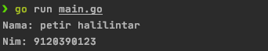
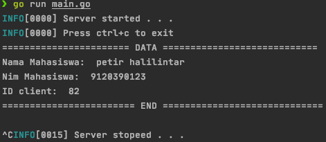

# go-socket-programming
This is examples of implementation socket programming with golang using net library

## Data structure  
| Field  |      Type      |  Description |
|----------|:-------------:|:------:|
| ID | int | Identifier of client connection |
| Nama |    string   |   Name of student |
| Nim | String |    Identifier of each Student |

## Screenshot
###Client 
 
From the image above: *client* send the data
###Server 
 
From the image above: *server* print the data