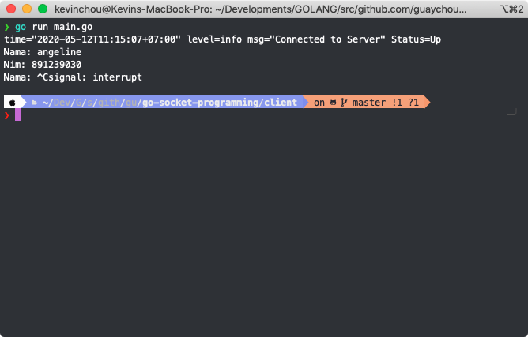
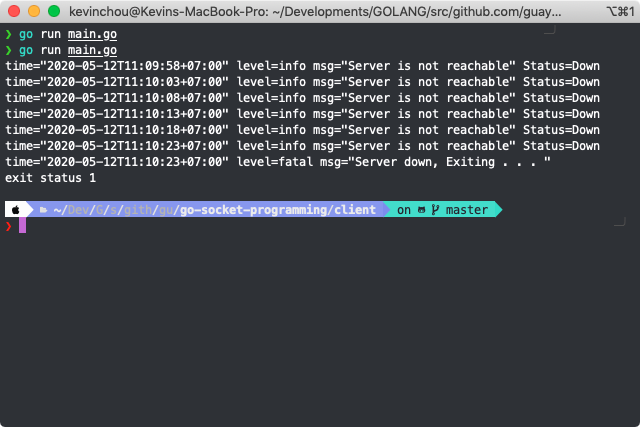
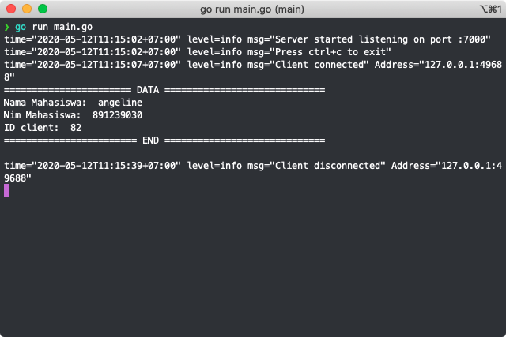

# go-socket-programming
This is examples of implementation socket programming with golang using net library

## Data structure  
| Field  |      Type      |  Description |
|----------|:-------------:|:------:|
| ID | int | Identifier of client connection |
| Nama |    string   |   Name of student |
| Nim | String |    Identifier of each Student |

## Screenshot
### Client 

  </a>
   
<strong><i>Client</i> send the data</strong>
  
  </a>
   
  <Strong>If server not reachable for 5 times, the client will be exited. </strong>

### Server 
 

  </a>
   
<strong><i>Server</i> get the data</strong>

